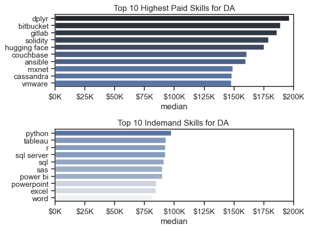

# The Analysis

## 1. What are the demanded skills for top 3 data roles?

View my notebook with detailed steps here:
[2_Skills_count.ipynb](3_Project\2_Skills_count.ipynb)

### Visualize data
```python
sns.set_theme(style='ticks')
fig, ax=plt.subplots(3,1)
for i,job_title in enumerate(job_titles):
    df_plot=df_skills_perc[df_skills_perc['job_title_short']==job_title].head(5)
    #df_plot.plot(kind='barh',x='job_skills',y='skill_percent',ax=ax[i],title=job_title,legend=False)
    sns.barplot(data=df_plot,x='skill_percent',y='job_skills',ax=ax[i],hue='skill_count',palette='dark:b_r',legend=False)
    #ax[i].invert_yaxis()
    ax[i].set_title(job_title)
    ax[i].set_xlabel('')
    ax[i].set_ylabel('')
    ax[i].set_xlim(0,90)
    for index,value in enumerate(df_plot['skill_percent']):
        ax[i].text(value+1,index,f'{value:.0f}%',va='center')
    if i!=len(job_titles)-1:
        ax[i].set_xticks([])

  
fig.suptitle('Top Skills for Data Jobs',fontsize=15)
fig.tight_layout()
plt.show()
```

### Results


### Insights

1️⃣ Data Analyst

Top skill: SQL (51%) → Most important technical skill for analysts.

Other important skills:

Excel (41%) → Strong spreadsheet skills still crucial.

Tableau (28%) → Visualization knowledge is moderately valued.

Python (27%) → Programming is useful but less critical than SQL/Excel.

SAS (19%) → Least in demand among listed skills.

Insight: For a Data Analyst, focus on SQL and Excel first, then visualization (Tableau) and programming (Python).

2️⃣ Data Engineer

Top skills: SQL (68%) and Python (65%) → Core coding and database skills are critical.

Cloud knowledge:

AWS (43%), Azure (32%) → Cloud platforms are increasingly required.

Big data tools: Spark (32%) → Knowledge of distributed computing is beneficial.

Insight: Data Engineers need strong SQL + Python, plus cloud & big data tool familiarity. Unlike analysts, programming and infrastructure knowledge are more important than Excel/Tableau.

3️⃣ Data Scientist

Top skill: Python (72%) → Most important for modeling, ML, and analytics.

Other important skills:

SQL (51%) → Data querying remains essential.

R (44%) → Statistical programming is also relevant.

SAS & Tableau (24% each) → Useful, but lower priority.

Insight: For Data Scientists, programming and statistical modeling (Python & R) dominate over visualization tools. SQL is still a must-have for data handling.

Overall Key Insights

SQL is fundamental for all data roles (Data Analyst: 51%, Data Engineer: 68%, Data Scientist: 51%).

Python is essential for Engineers (65%) and Scientists (72%), less for Analysts (27%).

Role-specific focus:

Analyst → Excel + SQL + basic Python/Tableau

Engineer → SQL + Python + Cloud + Spark

Scientist → Python + SQL + R + ML/statistics

Visualization tools (Tableau) are more important for Analysts than Engineers/Scientists.

Statistical tools (R, SAS) matter more for Scientists than Analysts or Engineers.


## 2. How are indemand skills trending for Data Analyst Jobs?

View my notebook for detailed steps here: [3_Skills_trend.ipynb](3_Project\3_Skills_trend.ipynb)

### Visualize Data
```python
sns.lineplot(data=df_plot,dashes=False,palette='tab10',legend=False)
sns.despine()
plt.title('Trending Top Skills for DA Jobs In US')
plt.xlabel('2023')
plt.ylabel('Likelihood of Getting a Job')
ax=plt.gca()
ax.yaxis.set_major_formatter(plt.FuncFormatter(lambda y,pos:f'{y:.0f}%'))
for i in range(5):
    plt.text(11.5,df_plot.iloc[-1,i],df_plot.columns[i])
plt.tight_layout
```

### Results


### Insights

Here are some short insights from your visualization of trending top skills for Data Analyst jobs in the US in 2023:

- SQL consistently shows the highest likelihood of getting a job (~45–55%) throughout the year.

- Excel remains the second most in-demand skill, though it declines from ~42% to ~34% by November, with a rebound in December.

- Python and Tableau hover around 25–30%, showing moderate but stable demand; Python slightly edges Tableau for most months.

- SAS shows the lowest demand (~17–22%) and remains relatively flat across the year.

Seasonal trends: SQL and Excel see minor dips in mid-year and a recovery towards the year-end. Tableau peaks slightly in August before declining.

## 3. How well do different level of jobs pay for data roles?

View my notebook for detailed steps here:[4_Salary_Analysis.ipynb](3_Project\4_Salary_Analysis.ipynb)

### Visualize Data
```python
sns.boxplot(data=df_US_top6,x='salary_year_avg',y='job_title_short',order=job_order)
sns.set_theme(style='ticks')

plt.ylabel('')
plt.xlabel('Yearly Salary')
plt.title('Salary Distributions In US')
plt.xlim(0,600000)
ax=plt.gca()
ax.xaxis.set_major_formatter(plt.FuncFormatter(lambda x,pos:f'${int(x/1000)}k'))
```

### Results


### Insights 
Yet to be posted!!

### Highest Paid and Most demanded skills for DA?

#### Visualize Data:

```python
fig, ax=plt.subplots(2,1)
#df_DA_US_highpay.plot(kind='barh',y='median',ax=ax[0],legend=False)
sns.barplot(data=df_DA_top_pay,x='median',y=df_DA_top_pay.index,ax=ax[0],hue='median',palette='dark:b_r',legend=False)
#ax[0].invert_yaxis()
ax[0].set_title('Top 10 Highest Paid Skills for DA')
ax[0].set_ylabel('')
ax[0].set_xlim(0,200000)
ax[0].xaxis.set_major_formatter(plt.FuncFormatter(lambda x,pos:f'${int(x/1000)}K'))
plt.legend().set_visible(False)
#df_DA_US_indemand.plot(kind='barh',y='median',ax=ax[1])
sns.barplot(data=df_DA_skills,x='median',y=df_DA_skills.index,ax=ax[1],hue='median',palette='light:b')
#ax[1].invert_yaxis()
ax[1].set_xlim(0,200000)
ax[1].set_ylabel('')
ax[1].set_title('Top 10 Indemand Skills for DA ')
ax[1].xaxis.set_major_formatter(plt.FuncFormatter(lambda x,pos:f'${int(x/1000)}K'))
plt.tight_layout()
plt.legend().set_visible(False)
```
 
 #### Results

 

 #### Insights
 Yet to be posted!!

 ## 4. What is the most optimal skill to learn for data analysts?

 View my notebook for detailed steps here: [5_Optimal_Skills.ipynb](3_Project\5_Optimal_Skills.ipynb)

 ### Visualize Data

 ```python
 from adjustText import adjust_text
#df_plot.plot(kind='scatter',x='skill_percent',y='median_salary')
sns.scatterplot(
    data=df_plot,
    x='skill_percent',
    y='median_salary',
    hue='technology'

)
sns.despine()
sns.set_theme(style='ticks')
plt.xlabel('Percentage of Job Postings')
plt.ylabel('Median Yearly Salary')
plt.title('Most Optimal Skills for Data Analyst In US')

texts=[]
for i ,txt in enumerate(df_DA_Skills_high_demand.index):
    texts.append(plt.text(df_DA_Skills_high_demand['skill_percent'].iloc[i],df_DA_Skills_high_demand['median_salary'].iloc[i],txt))
adjust_text(texts,arrowprops=dict(arrowstyle='->',color='r',lw=0.5))
ax=plt.gca()
ax.yaxis.set_major_formatter(plt.FuncFormatter(lambda y,pos: f'${int(y/1000)}K'))
ax.xaxis.set_major_formatter(plt.FuncFormatter(lambda x,pos: f'{x:.0f}%'))
plt.tight_layout()
plt.show()

 ```

 ### Results


### Insights

- Python offers the highest salary (~$98K) and is also widely demanded (~25% postings) → best overall skill.

- SQL has the highest demand (~58% postings) with a strong salary (~$92K) → most in-demand baseline skill.

- Tableau also pays well (~$93K) and is moderately in demand (~30%).

- Excel is very common (~42% postings) but has relatively lower salary (~$84K).

- Word & PowerPoint are common office tools but low-paying skills (~$81K–$85K).

- Databases like Oracle & SQL Server pay high (~$93K–$97K) but are less common (<10% postings).

- R and SAS are niche skills (18–20% demand) with good pay ($90K–$92K).

- Cloud (Oracle) has the highest salary but lowest demand.

To be a competitive Data Analyst in the US, focus on SQL + Python (core), then add Tableau (visualization) and a database/cloud skill for maximum salary + demand balance.